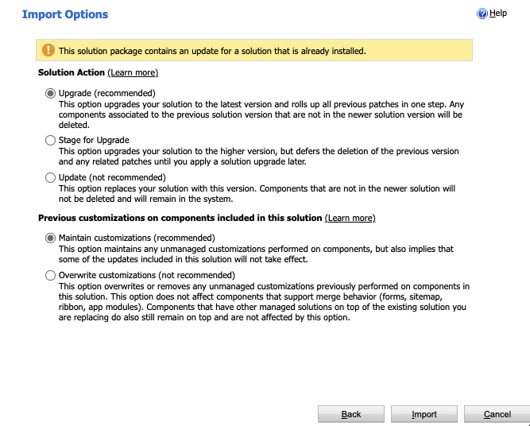
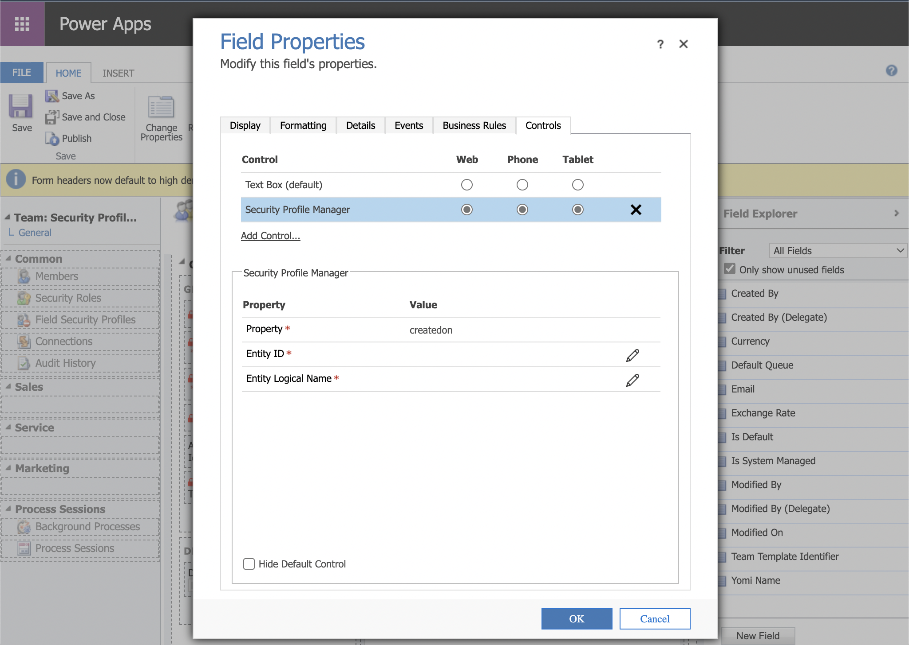
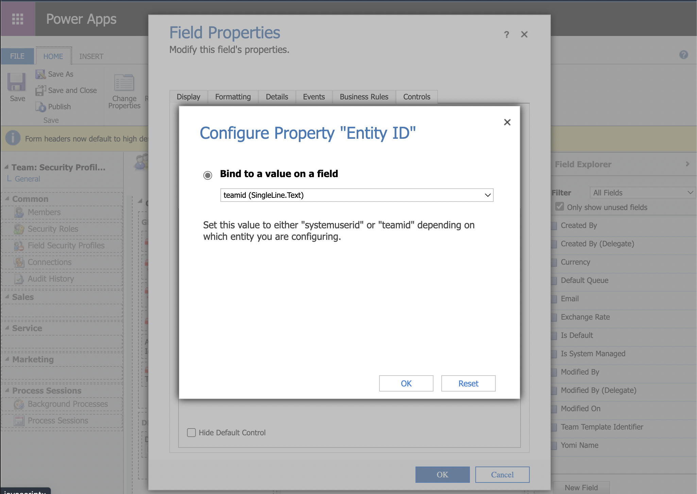
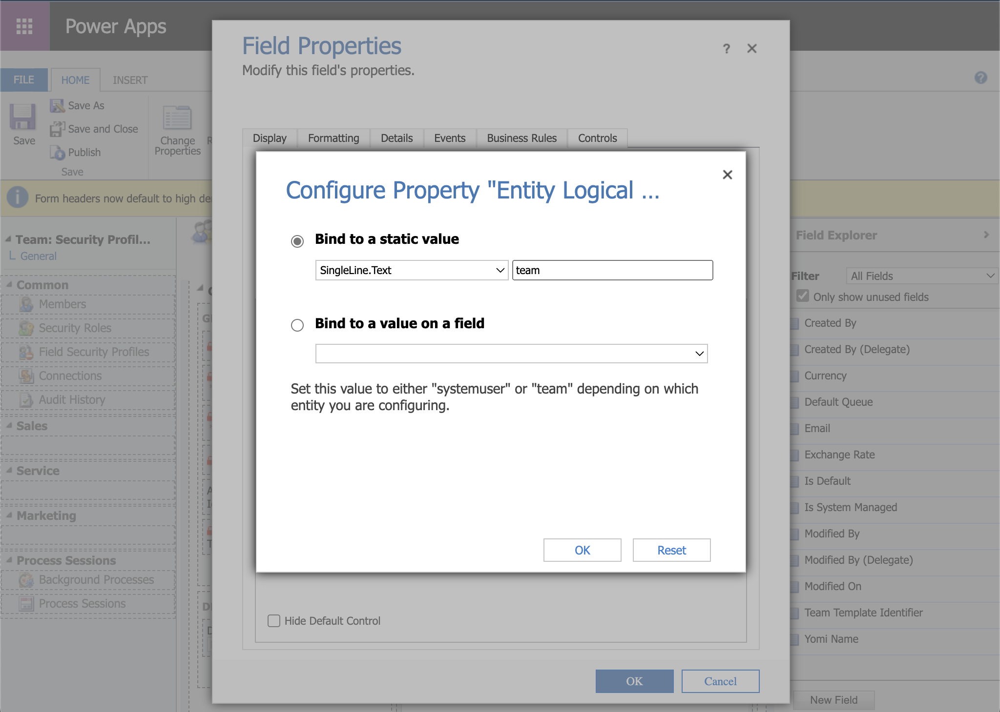
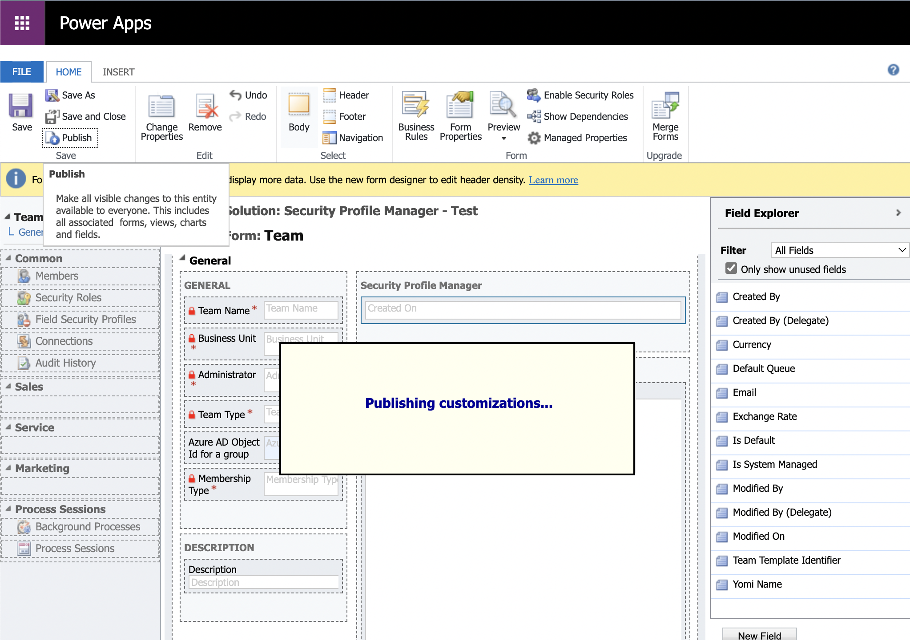

# Migration from V1 to V2

Please read these notes before deploying the V2 solution of this component.

---

## Importing the solution

Download the updated solution version from the [Releases Page](https://github.com/cathalnoonan/d365-pcf-securityprofilemanager/releases).

When importing the new solution, use the default options to apply the solution upgrade.

## Additional Configuration Required

After importing the solution, open the form(s) where the control is used from the classic interface.

Select and double-click the control containing the Security Profile Manager control to edit the properties.

In the `Controls` tab, there will be additional options under the `Security Profile Manager` control.

These three properties need to be assigned a value for the control to function properly.
- Entity ID
- Entity Logical Name

### Entity ID
- This field should be bound to the primary key field of the entity; i.e. `systemuserid` or `teamid`
 

### Entity Logical Name
- Select the `Bind to a static value` option.
- Type `systemuser` or `team`.
  

---

Save, Publish, Refresh the form.
