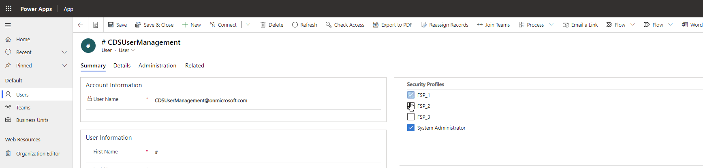

# Field / Column Security Profile Manager

A PCF control to add or remove field security profiles for a user or team.

---

## Configuration

When adding the control to the form, open the form in the classic interface

1. Add an unused field to the form
   > Note: This field is not used by the control, it is just an anchor for the control
   > it can be any of the following types:
   > - Currency
   > - DateTime
   > - Decimal
   > - Enum
   > - Single Line of Text
   > - Multiple Line of Text
   > - Two Options

2. Double click the field to open the field properties

3. Select the "Controls" tab

4. Click "Add Control..."

5. Select "Security Profile Manager"

6. Click "Add"

7. Select "Web", "Phone", "Tablet" as appropriate for your system

8. Select the "Display" tab

9. Uncheck "Display label on the form"

10. Click OK

11. Save & Publish the form

---

## Building the control from source

The build scripts assume the following software is installed:
| Name | Link |
|:---|:---|
| dotnet | [https://dotnet.microsoft.com/download](https://dotnet.microsoft.com/download) |
| node | [https://nodejs.org/en/](https://nodejs.org/en/) |
| yarn | [https://yarnpkg.com/getting-started/install](https://yarnpkg.com/getting-started/install) |

### On Windows
The `win-*.bat` scripts at the root of the project are used to build the project
- `win-build.bat` script will build the solution
- `win-clean.bat` script will remove the node_modules, or other build related files

### On Mac
The `mac-*.zsh` scripts at the root of the project are used to build the project
- `mac-build.zsh` script will build the solution
- `mac-clean.zsh` script will remove the node_modules, or other build related files