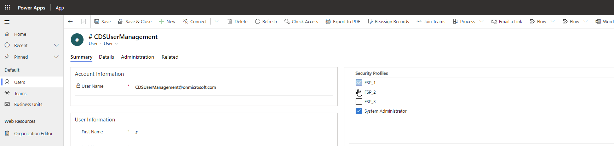

# Field / Column Security Profile Manager

A PCF control to add or remove field security profiles for a user or team.

---

## Download
Download a managed solution from the [releases page](https://github.com/cathalnoonan/d365-pcf-securityprofilemanager/releases).

## Docs
- [Installation and Configuration](docs/installation-and-configuration.md)
- [Migration from V1 to V2](docs/migration-v1-v2.md)
- [Building solution from source code](docs/building-solution-from-source-code.md)

---

## LICENSE: MIT